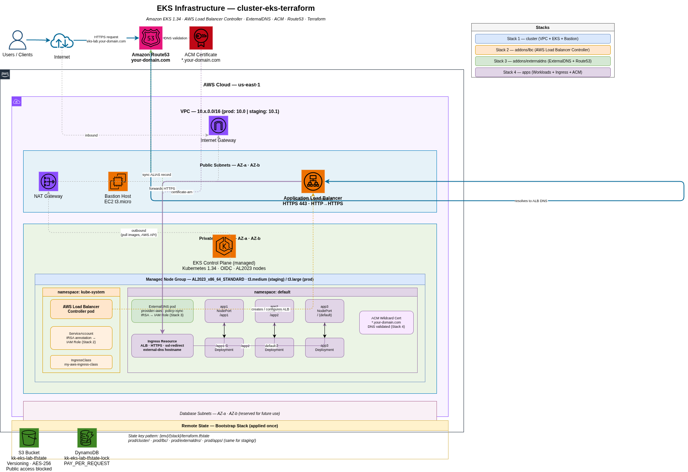

# cluster-eks-terraform

Production-ready Amazon EKS infrastructure managed with Terraform. The project is split into four independent stacks deployed in sequence, each with its own remote state and GitLab CI/CD pipeline.

## Architecture

```
┌─────────────────────────────────────────────────────────────────┐
│  Stack 1 — cluster                                              │
│                                                                 │
│  VPC ──► EKS 1.34 ──► Node Group (AL2023)                      │
│           │                                                     │
│           └──► Bastion Host (EC2)                               │
└─────────────────────────────────────────────────────────────────┘
                │ outputs: cluster_endpoint, oidc_provider_arn, vpc_id …
                ▼
┌─────────────────────────────────────────────────────────────────┐
│  Stack 2 — addons/lbc                                           │
│                                                                 │
│  IRSA Role ──► AWS Load Balancer Controller (Helm)              │
│                        │                                        │
│                        └──► IngressClass: my-aws-ingress-class  │
└─────────────────────────────────────────────────────────────────┘
                │
                ▼
┌─────────────────────────────────────────────────────────────────┐
│  Stack 3 — addons/externaldns                                   │
│                                                                 │
│  IRSA Role ──► ExternalDNS (Helm) ──► Route53 (sync policy)    │
└─────────────────────────────────────────────────────────────────┘
                │
                ▼
┌─────────────────────────────────────────────────────────────────┐
│  Stack 4 — apps                                                 │
│                                                                 │
│  ACM Wildcard Cert ──► Ingress (ALB, HTTPS)                     │
│                              │                                  │
│               ┌──────────────┼──────────────┐                  │
│               ▼              ▼              ▼                   │
│            /app1          /app2          / (default)            │
│           NodePort        NodePort       NodePort               │
│           Service         Service        Service                │
│              │               │               │                  │
│           Deployment      Deployment      Deployment            │
└─────────────────────────────────────────────────────────────────┘
                │
                ▼
       ExternalDNS registers ALB alias in Route53
       eks-lab.your-domain.com ──► ALB DNS
```



## Stacks

| # | Path | What it provisions | README |
|---|------|--------------------|--------|
| 1 | `cluster/` | VPC, EKS cluster, managed node group, Bastion | [cluster/README.md](cluster/README.md) |
| 2 | `addons/lbc/` | AWS Load Balancer Controller (Helm + IRSA) | [addons/lbc/README.md](addons/lbc/README.md) |
| 3 | `addons/externaldns/` | ExternalDNS (Helm + IRSA + Route53) | [addons/externaldns/README.md](addons/externaldns/README.md) |
| 4 | `apps/` | Kubernetes workloads, Ingress, ACM certificate | [apps/README.md](apps/README.md) |

## Environments

| Branch    | Environment | State prefix        |
|-----------|-------------|---------------------|
| `main`    | prod        | `prod/<stack>/`     |
| `staging` | staging     | `staging/<stack>/`  |

Each environment has completely isolated infrastructure and Terraform state. The `staging` branch is the integration environment; merge to `main` to promote to prod.

## Remote state

| Resource       | Name                      |
|----------------|---------------------------|
| S3 bucket      | `kk-eks-lab-tfstate`      |
| DynamoDB table | `kk-eks-lab-tfstate-lock` |
| Region         | `us-east-1`               |

The backend `key` is never hardcoded — it is injected at `terraform init` via `-backend-config="key=<env>/<stack>/terraform.tfstate"`, allowing the same code to target any environment.

## CI/CD

All four stacks share the same pipeline structure. The root `.gitlab-ci.yml` includes each stack's sub-pipeline:

```
validate ──► plan ──► apply (manual) ──► destroy (manual)
```

Jobs are scoped by branch and file changes:
- Push to `main` → prod jobs for changed stacks
- Push to `staging` → staging jobs for changed stacks

The runner is `vps-native-runner` (tagged `docker`), a shell executor with Docker socket access. Terraform runs inside a `hashicorp/terraform:1.9` container via `docker run`.

## Deploy order

Stacks must be applied in sequence — each addon reads the cluster outputs from remote state.

```
1. cluster:apply
2. lbc:apply
3. externaldns:apply
4. apps:apply
```

Destroy in reverse:

```
4. apps:destroy
3. externaldns:destroy
2. lbc:destroy
1. cluster:destroy
```

## GitFlow

```
feature/* ──► staging   (validate + plan auto / apply manual)
staging   ──► main      (promote to prod via Merge Request)
```

## Provider versions

| Provider   | Version  |
|------------|----------|
| AWS        | `~> 6.0` |
| Kubernetes | `~> 3.0` |
| Helm       | `~> 3.0` |
| HTTP       | `~> 3.4` |
| Terraform  | `>= 1.9` |

## Prerequisites

- AWS CLI with a named profile configured
- Terraform >= 1.9
- S3 bucket + DynamoDB table for remote state (created once, shared across environments)
- Route53 hosted zone for your domain
- EC2 key pair for Bastion SSH access

## Cost awareness

| Resource          | Approx. cost             |
|-------------------|--------------------------|
| EKS control plane | ~$0.10/h per cluster     |
| NAT Gateway       | ~$0.045/h + data         |
| EC2 nodes         | depends on instance type |
| ALB               | ~$0.008/h + LCU charges  |

Destroy after each session to avoid idle charges.
